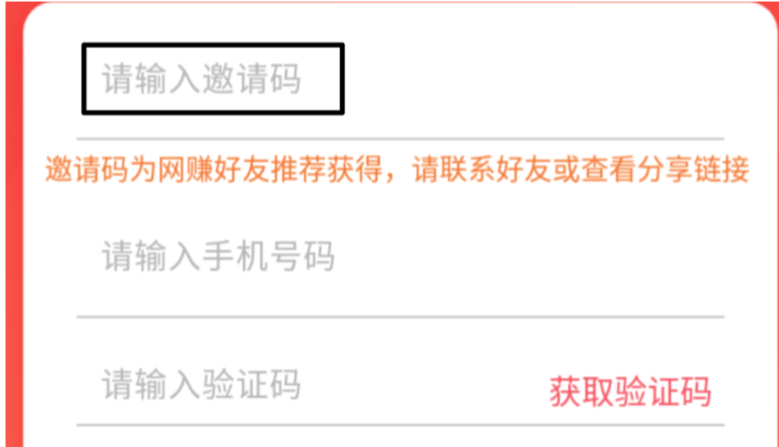
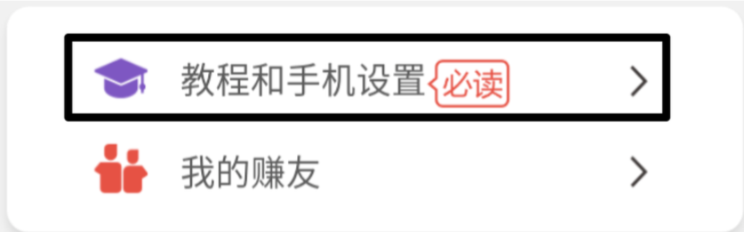

> 全傻瓜化`无需人工干预`的网赚软件，每天只需点一下按钮，`月入3000+`

# 软件下载
目前仅支持安卓手机刷单。

如果没有安卓手机可以下载安卓模拟器（比如网易mumu模拟器http://mumu.163.com)

http://www.lunamoon.net/mi 根据自己的机型选择

# 注册账号
打开客户端，点击底部的注册

输入邀请码才可以注册
邀请码不同，收益也不一样，以下是小编搜集的几个级别比较高的邀请码（当天有效，每日更新）

> `2019-03-01`邀请码

|邀请码|返利|商品利润|单日净赚（假设日刷3000元）|30日收入|
|:---:|:---:|:-------:|:-----------------------:|:--------:|
|`30194117`|1/1000|3/1000|120|3600|
|`301125622`|5/10000|3/1000|105|3150|
|`301136239`|0|3/1000|90|2700|

# 阅读教程

不按教程操作，可能导致接单率降低，资金损失。请一定查阅。

# 使用建议
- 一定记得在接单时让微信支付宝置于后台也就几分钟就刷完了，否则无法自动完成订单，会导致回款变慢或需 要肉眼核对
- 开始时可以小额试用，入门门槛极低，99.7元就可以
- 建议只开微信收款

# 小贴士

## 如何判断已达微信支付限额?

- 如何判断已达微信支付限额?

    最近的单子都是发货中就可以简单判断了，更准确的做法是让身边的人拿手机扫描的收款码，写一个大于200的金额，如果不成功，就是限额了，今天就不用接微信的单子了。

    良好的刷单习惯可以让你信用分值更高，更快的接到单子。

    微信限额跟你平时使用微信首付款习惯有关，坚持几天，限额阈值会稳步上升。

- 每日限额是多少?

    微信一般单日2-5万限额、10-15次交易;支付宝一般单日2-5万限额、10次以内交易;很多时候没有到就会限额，建议多建立几个微信支付宝小号，轮换刷单;如果出现长时间没有成功单子，证明已经限额了，打烊后显示库存下架， 再更换新二维码;

    如果微信和支付宝收到限额或者异常信息，及时点击信息，根据提示进行解锁即可，成功率不会很高，但是一旦成
功，相关的限制就会解开，单日就可以刷更多单;

                      
- 如何获取更多收益

    邀请朋友 教程中有 开户，对方使用，你也可以抽取佣金。

- 有没有客服，如何联系?

    下载聊天宝，各大应用商店都可以下载，有任何问题都在这个软件上反馈，客服账号在你刷单的时候点击联系客服即可获取; 

    在刷单过程中，不要尝试转账和刷单金额一致的金额验证是否限额，也不要用整百的验证，要验证尽量打烊或者转账带有小数点不是整数的金额验证，以免造成系统自动抓取和识别金额并扣单;

    当库存里面还有已发货的商品时，不要尝试切换微信或者支付宝，因为切换后店员通可能会重复播报已经完成的单，造成系统重复抓取信息扣单，损失自行承担;

    在没有确认自己微信或者支付宝未收到款项的时候，一定千万不能去点击收货好评，如果没收到钱手动点击收货好评，损失要自行承担;